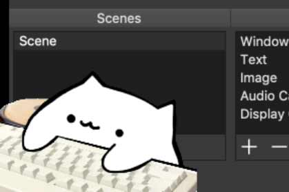

# mac-typing-cat



**NOTICE: This code has been reported by many to have compatibility issues. Use at your own risk.**

A lovely cat that types for you. It's used as streaming overlay, with a borderless transparent background. You can also reskin it (and change the keys in `main.py`) to turn it into a mania-cat.

works for **macOS only**. For Windows / Linux, check out [bongocat-osu](https://github.com/kuroni/bongocat-osu).

## Prerequisites

```bash
python3 -m pip install pyobjc-framework-ApplicationServices pyobjc-framework-CoreText
```

## Usage

```bash
python3 main.py
```

If the program successfully launches but doesn't respond to global keypressed, retry with:

```bash
sudo python3 main.py
```

If the program quits with

```plain
ERROR: Unable to create event tap.
```

You need to allow `Terminal` to control your computer by going to `System Preferences.app > Security & Privacy > Privacy > Accessibility` and check on `Terminal`.

Note that it's not floating on top of all windows automatically. You need to capture it separately in your streaming software (e.g. Window capture in OBS) and adjust its size / position.

## Known bugs

Image ghosting.

works fine for images with identical outlines.

## Some Bug Fixes.

If your window is completly transparent or is not loading, Look for these lines of code and add # before the lines for the following:

`root.overrideredirect(True)`

`root.wm_attributes("-topmost", True)`

It should look like this.

`# Hide the root window drag bar and close button
#root.overrideredirect(True)
# Make the root window always on top
#root.wm_attributes("-topmost", True)`

If you do not have administrator access and your pip is replying with something related to: 
Has No permission to Install to /Where/python3/is/installed/ then add the --user option to the end of the pip install packages module.
it should look like this:

```python3 -m pip install pyobjc-framework-ApplicationServices pyobjc-framework-CoreText --user```

## License

The cat image is from [bongo.cat](https://bongo.cat/) by Eric Huber (@Externalizable). Art courtesy of @StrayRogue. Meme by @DitzyFlama.

Codes copied from other websites or projects (see comment in code) may have their own license.

Other parts are released into public domain.
